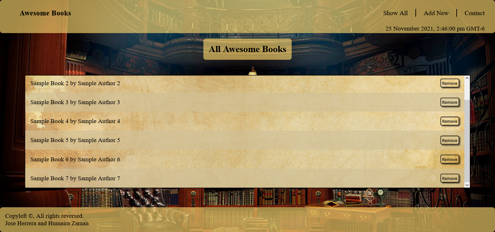

# Awesome Books

> This is a website to build, store, and display a catalogue of books. Still in beta version, it is nevertheless functional, adding and removing any book from the catalogue.

Additional description about the project and its features.

## Built With

- Html
- CSS
- Javascript

## Live Demo

[Live Demo Link](https://qwibbler.github.io/awesome-books/)

## Getting Started

## Authors

👤 **Humaira Zaman**

- GitHub: [@qwibbler](https://github.com/qwibbler)
- Twitter: [@hmemaz](https://twitter.com/hmemaz)
- LinkedIn: [Humaira Zaman](https://www.linkedin.com/in/hmemaz1994/)

👤 **Jose Fernando Herrera**

- GitHub: [@joseheco](https://github.com/joseheco)
- Twitter: [@twitterhandle](https://twitter.com/twitterhandle)
- LinkedIn: [LinkedIn](https://linkedin.com/in/linkedinhandle)

## 🤝 Contributing

Contributions, issues, and feature requests are welcome!

Feel free to check the [issues page](../../issues/).

## Show your support

Give a ⭐️ if you like this project!

## Acknowledgments

- [Microverse](https://github.com/microverseinc/curriculum-javascript/blob/main/books/sneak_peek.md)

## 📝 License

This project is [MIT](./MIT.md) licensed.
